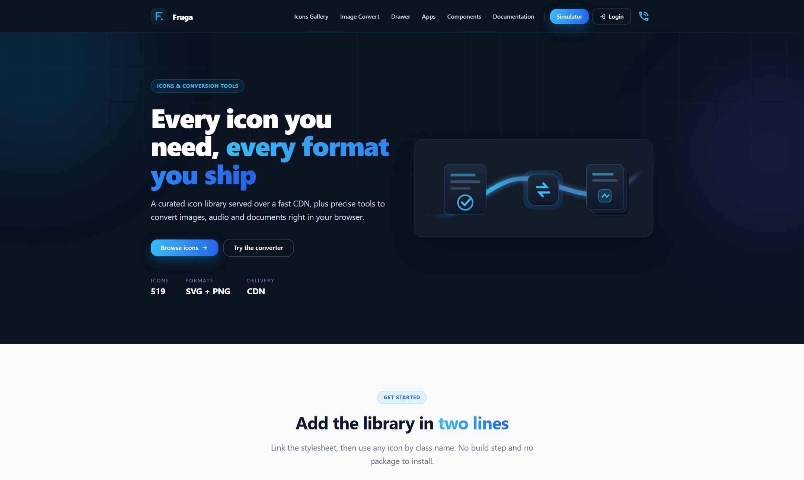
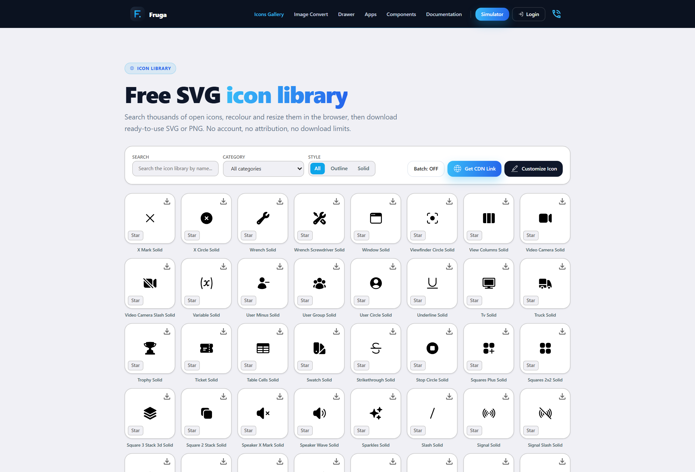
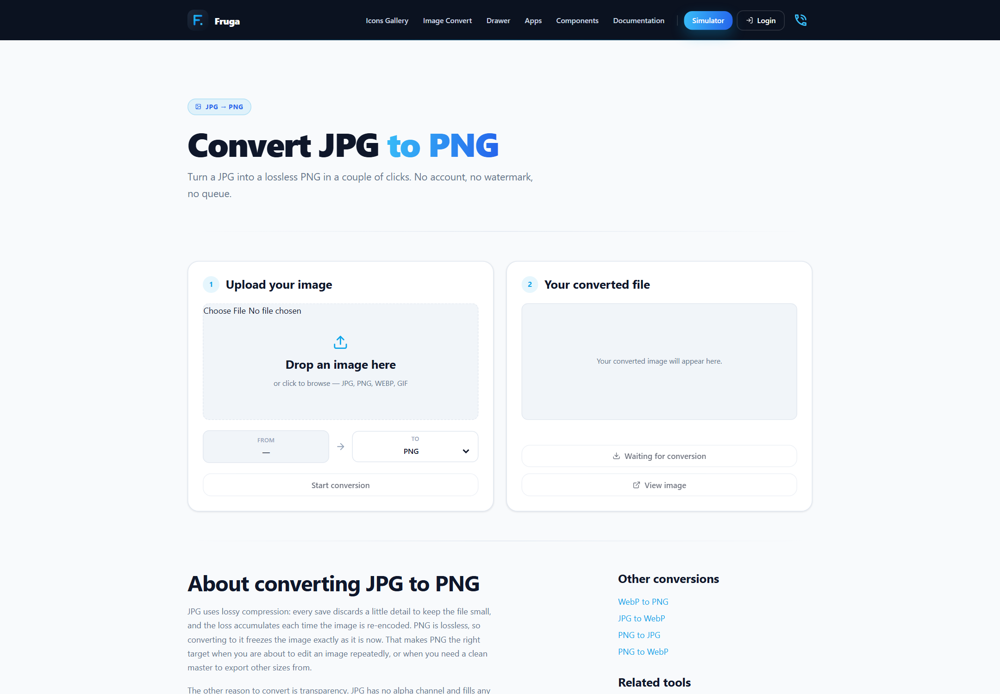
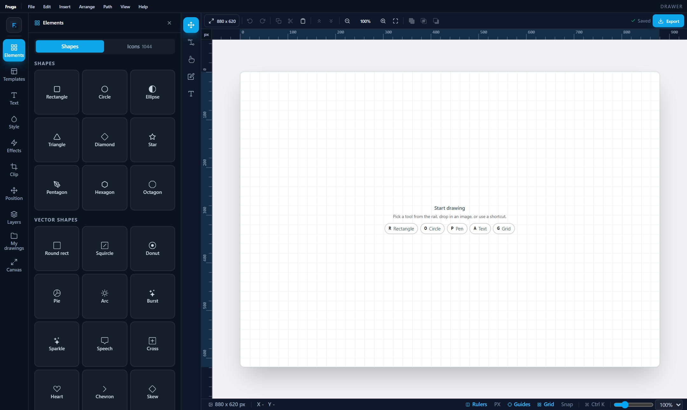

<div align="center">


# FrugalDomain

**مكتبة أيقونات SVG مجانية، وأدوات تحويل تعمل في المتصفح، ومنصّة Laravel معيارية لإدارة الكتالوج والمخزون والمحتوى والطلبات.**

[](https://laravel.com)
[](https://php.net)
[](https://react.dev)
[](https://vite.dev)
[](https://tailwindcss.com)

[](https://frugaldomain.site/ar/IconsGalary)
[](https://frugaldomain.site/sitemap.xml)
[](https://frugaldomain.site/ar)

**[الموقع المباشر](https://frugaldomain.site/ar)** ·
[مكتبة الأيقونات](https://frugaldomain.site/ar/IconsGalary) ·
[التوثيق](https://frugaldomain.site/ar/documentation) ·
[English](README.md)



</div>

---

هذا المستودع نسخة مطابقة لمجلّد `public_html` على خادم الإنتاج. ما تراه في
الجذر هو ما يُقدَّم للزوّار فعلياً.

```
public_html/
├── index.html, assets/, IconsGalary/, convert/, ar/, …   → frugaldomain.site
├── .htaccess                                             → توجيه SPA وإعادة التوجيه
├── api/                                                  → api.frugaldomain.site
└── cdn/                                                  → cdn.frugaldomain.site
```

| الجزء | التقنيات | مكانه |
|:--|:--|:--|
| **الواجهة** | React 19 · Vite 7 · Tailwind 4 · React Router 7 | `sydev-front/` *(غير مرفوع)* |
| **الـ API** | Laravel 12 · PHP 8.2 · Sanctum | `api/` |
| **الـ CDN** | Laravel 12 — يقدّم `icons.css` وملفات الأيقونات | `cdn/` |

---

## ماذا يقدّم الموقع

### 🎨 مكتبة الأيقونات

519 أيقونة بصيغتي SVG وPNG، قابلة للبحث والتصفية حسب الفئة والنمط. يمكن تعديل
اللون والحجم وسماكة الخط داخل المتصفح قبل التنزيل، والملف الذي تنزّله هو نفسه
الذي عاينته. لا حاجة إلى حساب — إنشاء الحساب يضيف فقط المفضّلة وسجل التنزيلات
والمجموعات المخصّصة.



### 🔄 أدوات التحويل

| الأداة | الصيغ |
|:--|:--|
| [الصور](https://frugaldomain.site/ar/ImageConvert) | JPG · PNG · WebP · GIF |
| [الصوت](https://frugaldomain.site/ar/AudioConvert) | MP3 · WAV · OGG · AAC |
| [المستندات](https://frugaldomain.site/ar/FileConvert) | DOCX ← PDF · XLSX ← PDF |

ولكل تحويل شائع للصور صفحته الخاصة تحت `/convert/<from>-to-<to>` — المحوّل مع
الصيغة الهدف محدَّدة مسبقاً، يليه شرح لأثر ذلك التحويل على الجودة وحجم الملف
والشفافية، وأسئلة شائعة تُنشر أيضاً كبيانات مهيكلة.



### ✏️ لوح الرسم المتجه

محرّر داخل المتصفح للأشكال والمسارات، مع الطبقات وتحرير العقد وتصدير SVG نظيف.



### 👆 محاكي اللمس

يولّد إدخال لمس اصطناعياً لاختبار معالجات الإيماءات، ويلتقط بيانات ضربات
الكتابة اليدوية — نقاط مرتّبة مع التوقيت — لتدريب نماذج التعرّف وتقييمها.

### 📦 معرض التطبيقات

أربعة تطبيقات منشورة على المنصّة، لكلٍّ منها صفحة توثيق ومعاينة حيّة في المتصفح:

| التطبيق | ماذا يفعل |
|:--|:--|
| **Kanaf** | إدارة الجمعيات الخيرية — التبرّعات والمستفيدون والمشاريع ومحاسبة الأموال المقيَّدة |
| **Saydalati** | صيدليات متعدّدة الفروع — الصرف ومخزون يراعي الصلاحية والمحاسبة |
| **frugal** | محاسبة ومخزون ونقاط بيع، تعمل دون إنترنت على الشبكة المحلية |
| **Manex** | إدارة مؤسسية — الموظفون والفروع والتعاميم وأرشيف الملفات |

---

## الـ API

سبعة عشر موديولاً مستقلاً تحت `api/app/Modules/`، لكلٍّ منها مساراته ومتحكّماته
ونماذجه وترحيلاته وبذوره:

```
App        Billing   CMS        Catalog   Core      Fulfillment
Gesture    Icon      Inventory  Locale    Marketing MobileApp
Orders     Shipping  Stores     Tax       User
```

<details>
<summary><b>النقاط العامة</b></summary>

<br>

| المجال | النقاط |
|:--|:--|
| الأيقونات | `/icons` · `/download-icon/{file}` · `/get-icon-svg/{file}` · `/get-icon-jsx/{file}` |
| التحويل | `/convert-image` · `/download-image/{file}` |
| اللغات | `/locale/{lang}` · `/active-languages` |
| الإيماءات | `/gestures` · `/gestures/count/{character}` |
| التحليلات | `/track/visit` · `/track/icon` |
| التواصل | `/site/contact-us` |

كل ما هو تحت `/admin` محمي بمصادقة Sanctum.

</details>

[`/documentation`](https://frugaldomain.site/documentation) على الموقع هو مرجع
التكامل: ربط المتجر، ودمج تطبيقات Flutter، ونشر التطبيقات، وواجهة REST.

---

## العمل على الواجهة

مصدر الواجهة يُطوَّر محلياً ومستثنى عمداً من هذا المستودع — يُنشر ناتج البناء فقط.

```bash
cd sydev-front
npm install
npm run dev              # خادم التطوير المحلي
npm run build            # يكتب sydev-front/dist
cp -r dist/. ..          # نسخ البناء إلى جذر المستودع
```

> [!IMPORTANT]
> **`npm run build` يعود قبل أن ينتهي الـ prerender من كتابة الملفات.** مجلدات
> المسارات تظهر تحت `dist/` بعد خروج الأمر بمدّة. ونسخ `dist/` مبكراً ينشر
> ملفات HTML تشير إلى حزمة JS من بناء آخر، فتتعطّل كل الصفحات عن الإقلاع — بينما
> يبدو كل شيء سليماً في قائمة الملفات. انتظر وجود كل مجلدات المسارات، وتحقّق من
> تطابق بصمات الـ assets، قبل نسخ أي شيء.

الـ prerender يحتاج Chrome أو Edge مثبّتاً محلياً، **ولا يحتاج أي نسخة Chrome
أخرى تعمل** — وإلا لن يتمكّن من إنهاء عملياته الفرعية ولن يكتب شيئاً بصمت.
و`PRERENDER=0 npm run build` يتخطّى اللقطات، و`PUPPETEER_EXECUTABLE_PATH` يوجّهه
إلى متصفح في مسار غير معتاد.

---

## المسارات والـ prerendering والـ SEO

`sydev-front/scripts/routes.js` هو المصدر الوحيد للمسارات القابلة للفهرسة. كل
مدخل فيه يُحوَّل إلى لقطة HTML ثابتة عبر `vite.config.js`، ويُكتب في
`sitemap.xml` عبر `scripts/generate-sitemap.js` — فلا يمكن أن تُبنى صفحة دون أن
تظهر في الـ sitemap، ولا أن تُدرج في الـ sitemap بلا لقطة خلفها.

**43 مساراً** مبنية حالياً — 22 بالإنجليزية و21 بالعربية.

<details>
<summary><b>لماذا النسخة العربية تحت <code>/ar/</code></b></summary>

<br>

وليست خلف مبدّل لغة، لسببين: الرابط الواحد لا يمكن فهرسته بلغتين، و`hreflang`
يحتاج عنواناً مستقلاً لكل لغة؛ كما أن الترجمة القادمة من الـ API تصل **بعد** أن
يكون الـ prerender قد أخذ لقطته، فترجمة مرتبطة بمبدّل لن تصل إلى الزاحف أبداً.

لذلك يعيش النص العربي لتلك الصفحات في `sydev-front/src/data/i18n/ar.js` داخل
الحزمة. وكل صفحة تحمل إشارات `hreflang` متبادلة — لأن Google يتجاهل الإشارة
أحادية الجانب تماماً.

</details>

إضافة صفحة هبوط لتحويل جديد تعني تعديل `sydev-front/src/data/conversions.js`
فقط — المسار واللقطة ومدخل الـ sitemap والبيانات المهيكلة تُولَّد كلها منه.

📄 **[SEO_NEXT_STEPS.md](SEO_NEXT_STEPS.md)** — ما تمّ إنجازه، وما يستحق العمل
عليه تالياً، وأربعة أخطاء تكسر الـ prerendering بصمت.

---

## النشر

📄 **[DEPLOYMENT.md](DEPLOYMENT.md)** — الإعداد الأول للخادم لتطبيقَي Laravel،
ونشر تطبيق تحت `/apps/<slug>/`، وبذرة الأيقونات، وما يجب تشغيله في عمليات النشر
اللاحقة.

لا يُشحن أي من تطبيقَي PHP مع `vendor/`، وملفات `.env` تُنشأ مباشرةً على الخادم
— ولا تُرفع أبداً.

---

## بنية المستودع

| المسار | |
|:--|:--|
| `index.html`, `assets/`, `images/` | الواجهة المبنيّة |
| `IconsGalary/`, `convert/`, `ar/`, … | لقطات المسارات الثابتة |
| `api/` | الـ API — الموديولات تحت `app/Modules/` |
| `cdn/` | الـ CDN — يبني `icons.css` من صفوف الأيقونات |
| `apps/<slug>/` | التطبيقات المنشورة، كل منها مستقلّ |
| `json/apps.json` | كتالوج التطبيقات، يُحرَّر من لوحة التحكم |
| `sitemap.xml`, `robots.txt` | يُولَّدان عند البناء، ويُستعادان بعد الـ prerender |
| `docs/screenshots/` | الصور المستخدمة في هذا الملف |

---

<div align="center">

**محمد ناصر الدين** — مطوّر Full-Stack · Laravel وReact

[الملف الشخصي](https://frugaldomain.site/ar/about-us/muhammed-nasser-edden) ·
[تواصل](https://frugaldomain.site/ar/Contact-Us) ·
[GitHub](https://github.com/mhamdNaser) ·
[LinkedIn](https://www.linkedin.com/in/muhammed-naser-edden)

<sub>© 2026 FrugalDomain. جميع الحقوق محفوظة.</sub>

</div>
